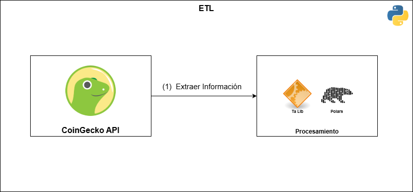

# **Pipeline Automatizado de Criptomonedas**

Este proyecto implementa un pipeline ETL (Extract, Transform, Load) automatizado para extraer datos históricos de criptomonedas desde la API de CoinGecko.





## ⚙️ **Instalación**
1. Clona este repositorio:
   ```bash
   git clone https://github.com/CristianPerafan/AutomatedPipeline.git
    cd AutomatedPipeline
    ```
2. Crea un entorno virtual e instala las dependencias:
   ```bash
    python -m venv venv
    source venv/bin/activate  # En Windows usa `venv\Scripts\activate`
    pip install -r requirements.txt
    ```
3. Configura las variables de entorno, en el root del proyecto puedes encontrar un archivo `.env.example` que puedes tomar como referencia.

---

## 🚀 **Uso**
1. Ejecuta la extracción de datos:
   ```bash
    python -m etl.extract
    ```
2. Ejecuta la transformación de datos:
    ```bash
    python -m etl.transform
    ```